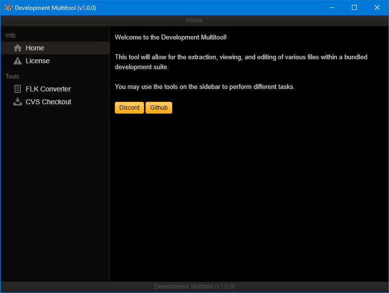
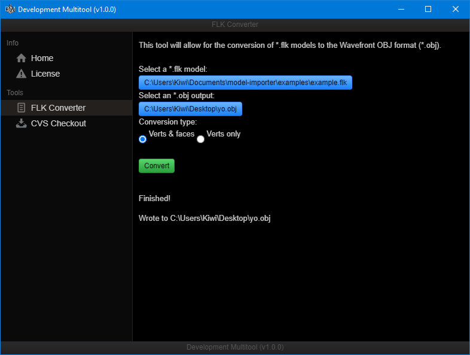
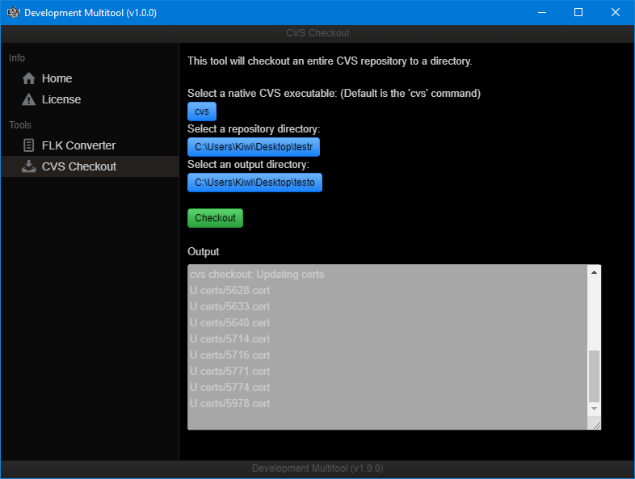

# Development Multitool

This [Electron](https://www.electronjs.org/) frontend allows for easy access to various tools.

## Tools

[FLK to Wavefront OBJ converter](https://github.com/TeamPopplio/flk-to-obj-converter)
[CVS Checkout](http://savannah.nongnu.org/projects/cvs)

## Multitool Usage

To use this tool, either run it using [Electron](https://www.electronjs.org/) or download binaries in [releases](https://github.com/TeamPopplio/development-multitool/releases/).

## 'FLK Converter' Usage

To use the 'FLK Converter' tool, you must first checkout the FLK file using CVS (see below).

Be aware that not all FLK file formats are supported, try using the 'Verts only' mode if any issues arise.

## 'CVS Checkout' Usage

To use the 'CVS Checkout' tool, you must download a copy of the ``cvs`` executable.

Download and extract the zip file for your platform [here](http://download.savannah.gnu.org/releases/cvs/binary/stable/) (``x86-woe/`` for Windows) and place the executable somewhere.

You may add it to your PATH variable but it's not necessary.

## Screenshots

## License

Copyright (c) 2020 KiwifruitDev
All rights reserved.

Permission is hereby granted, free of charge, to any person obtaining a copy
of this software and associated documentation files (the "Software"), to deal
in the Software without restriction, including without limitation the rights
to use, copy, modify, merge, publish, distribute, sublicense, and/or sell
copies of the Software, and to permit persons to whom the Software is
furnished to do so, subject to the following conditions:

The above copyright notice and this permission notice shall be included in
all copies or substantial portions of the Software.

THE SOFTWARE IS PROVIDED "AS IS", WITHOUT WARRANTY OF ANY KIND, EXPRESS OR
IMPLIED, INCLUDING BUT NOT LIMITED TO THE WARRANTIES OF MERCHANTABILITY,
FITNESS FOR A PARTICULAR PURPOSE AND NONINFRINGEMENT. IN NO EVENT SHALL THE
AUTHORS OR COPYRIGHT HOLDERS BE LIABLE FOR ANY CLAIM, DAMAGES OR OTHER
LIABILITY, WHETHER IN AN ACTION OF CONTRACT, TORT OR OTHERWISE, ARISING FROM,
OUT OF OR IN CONNECTION WITH THE SOFTWARE OR THE USE OR OTHER DEALINGS IN
THE SOFTWARE.

## Software Used

[Electron](https://www.electronjs.org/) (Licensed under the MIT License)
[Electron Forge](https://www.electronforge.io/) (Licensed under the MIT License)
[Photon](http://photonkit.com/) (Licensed under the MIT License)
[FLK to OBJ Converter](https://github.com/TeamPopplio/flk-to-obj-converter) (Licensed under the MIT License)
[Concurrent Versions System](http://savannah.nongnu.org/projects/cvs) (Licensed under the GNU General Public License, version 2)
